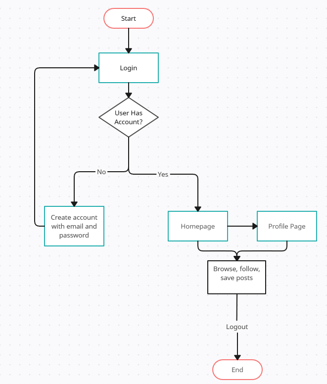

# Wanderlust - Share Your Travel Stories

Wanderlust is a social media platform built with the MERN stack (MongoDB, Express.js, React.js, Node.js) for travelers to share their stories, exchange travel advice, and connect with like-minded people around the world. Developed by Mike Novachek, Claudia Gillota, and Dorian Walker.

## Table of Contents

1. [Description](#description)
2. [User Flow](#user-flow)
3. [Features](#features)
4. [Installation](#installation)
5. [Usage](#usage)
6. [Contribution](#contribution)
7. [Tests](#tests)
8. [License](#license)
9. [Contact](#contact)

## Description

Wanderlust aims to create a community for travel enthusiasts where they can share their experiences, interact with posts by liking and commenting, and follow other users. It offers a safe and fun platform to express your wanderlust, inspire others, and be inspired.

## User Flow



## Features

1. User Authentication
2. Create, Read, Update, Delete (CRUD) operations for posts
3. Like, Comment on posts
4. Follow/Unfollow users
5. Travel Guides and Tips
6. Rich Text Editor for detailed stories
7. Search functionality for users and posts
8. Responsive UI design

## Installation

To install and run Wanderlust on your local machine:

1. Clone the repository:

```bash
git clone https://github.com/BigMikeNova/Wanderlust.git
Change your directory to the cloned repo:
cd Wanderlust
Install the dependencies:
npm install
Create a .env file in the root directory of the project and add your MongoDB connection string
MONGO_DB_CONNECTION_STRING=your_connection_string_here
Run the server:
npm start
```

## Usage

Once you've started the server, navigate to `http://localhost:3000` in your browser to start exploring the Wanderlust app.

## Contribution

Wanderlust was built by Mike Novachek, Claudia Gillota, and Dorian Walker. If you wish to contribute, please feel free to fork the repository and submit a pull request. For major changes, please open an issue first to discuss what you would like to change.

## Tests

For running tests, please use:

```bash
npm run test
```
## License

Wanderlust is released under the [MIT License](LICENSE).

## Contact

If you have any questions or concerns, please feel free to reach out.

- Mike Novachek: mike.novachek@gmail.com
- Claudia Gillota: cgillota@gmail.com
- Dorian Walker: dorianwalker.notes@me.com

Thank you for choosing Wanderlust. Enjoy the journey!